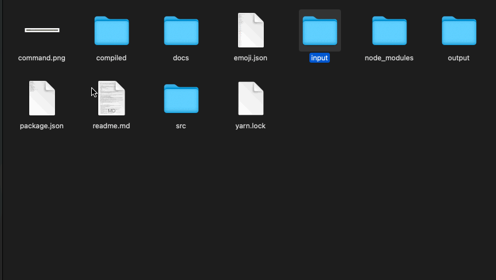

# cast-me

`cast-me` is a CLI app designed to automate the transcoding of video files (presumably screencasts). I originally created it due reduce the enormous file size of my quicktime screencasts.

Feature set it pretty thin at the moment. It does what I need it to do (for now). See RoadMap for ambitions - when time / motivation permits.

### **Check out the feature set below!**

I've dialled in a **single preset for coding screencasts**. FPS at 8 with no loss in the number of pixels. On longer `.mov` files, it's usual to see ~5% of the original file size.

## 🌎 Road Map

- Remove dependency on CLI `prompt` libraries
  - Re-implement using [`Ink`](https://github.com/vadimdemedes/ink) react-renderer.
- Use [Redux-Toolkit](https://redux-toolkit.js.org/) and [MemoryRouter](https://reactrouter.com/web/api/MemoryRouter) to manage state of application.
- Flesh out configuration options
  - FPS
  - Bitrate
  - Concatenate (with timecode meta output)
  - Transition
  - Overlay
  - ...
- Presets
- Local configuration files
- Web interface
- [Youtube Upload](https://quanticdev.com/articles/automating-my-youtube-uploads-using-nodejs/)
- Versioning / [NPM publishing](https://zellwk.com/blog/publish-to-npm/)
- [commander](https://github.com/tj/commander.js#readme) for CLI flag UI design.
- Use [Typescript](https://www.typescriptlang.org/)
  - In hindsight, I much - much prefer developing with Typescript.

## `ffmpeg`

These links formed some of my initial education into `ffmpeg`. `cast-me` now delegates to [`fluent-ffmpeg`](https://github.com/fluent-ffmpeg/node-fluent-ffmpeg) - a very convenient wrapper for node.

- [amerge](https://ffmpeg.org/ffmpeg-filters.html#amerge)
- [pan](https://ffmpeg.org/ffmpeg-filters.html#pan)
- [overlay](https://ffmpeg.org/ffmpeg-filters.html#overlay)
- [unsharp](https://ffmpeg.org/ffmpeg-filters.html#unsharp-1)
- [merge two clips](https://unix.stackexchange.com/questions/233832/merge-two-video-clips-into-one-placing-them-next-to-each-other/233833#233833?newreg=11acc58a32af465f91d8100eb4333fcd)
- [merge two audio](https://superuser.com/questions/1443476/how-to-merge-two-audios-files-by-the-using-ffmpeg-with-special-condition)
- [video in video](https://www.daniel-mitchell.com/blog/video-in-a-video-ffmpeg/#:~:text=Use%20ffmpeg%20to%20overlay%20a,using%20ffmpegs%20overlay%20filter%20command.&text=You%20can%20use%20the%20padding,a%20different%20corner%20as%20required.)
- [add watermark](https://gist.github.com/bennylope/d5d6029fb63648582fed2367ae23cfd6)
- [downscale with sharpness](https://superuser.com/questions/496738/what-is-the-best-way-to-downscale-mp4-video-while-keeping-it-as-sharp-as-possibl)
- [scale filter](https://trac.ffmpeg.org/wiki/Scaling)
- [convert media formats](https://opensource.com/article/17/6/ffmpeg-convert-media-file-formats)
- [transitions](https://ottverse.com/crossfade-between-videos-ffmpeg-xfade-filter/)
- [fleunt-ffmpeg](https://www.npmjs.com/package/fluent-ffmpeg)
- [oclif](https://oclif.io/)

## Library Links

**Links kept here for my benefit. Please _ignore_!**

- [YArgs](https://www.npmjs.com/package/yargs)
- [Yargs TS](https://github.com/yargs/yargs/blob/HEAD/docs/typescript.md)
- [Parsing CMD Line Args](https://nodejs.org/en/knowledge/command-line/how-to-parse-command-line-arguments/)
- [Chokidar](https://www.npmjs.com/package/chokidar)
  - File Watcher (works fine with polling)
- [Inquirer](https://github.com/SBoudrias/Inquirer.js)
  - Prompt Library (remove)
- [Command Line Colors](https://stackoverflow.com/questions/9781218/how-to-change-node-jss-console-font-color)
  - Not necessary with Ink
- [Get File Extension (node)](https://stackoverflow.com/questions/10865347/node-js-get-file-extension)
- [Shebangs](https://alexewerlof.medium.com/node-shebang-e1d4b02f731d)
  - My first introduction. Use language interpreters (node) without actually calling them.
- [Video Containers](https://en.wikipedia.org/wiki/Comparison_of_video_container_formats)
- [Pretty-Print JSON](https://stackoverflow.com/questions/4810841/pretty-print-json-using-javascript)
  - The more you know.
- [Glob](https://www.npmjs.com/package/glob)
  - File name pattern matching. Used extensively.
- [7 Tools for CLI](https://yvonnickfrin.dev/seven-libraries-to-build-nodejs-cli)
- [Publishing to NPM](https://medium.com/@ExplosionPills/publishing-an-npm-package-its-easy-c7ffdb4bb41d)
  - On the road map.
- [CLI Highlight](https://github.com/felixfbecker/cli-highlight#readme)
  - In conjunction with pretty print.
- [Enquirer](https://www.npmjs.com/package/enquirer#autocomplete-prompt)
  - Alternative to `inquirer`. Again, `ink` is better solution.
- [How to Build a Node CLI](https://www.twilio.com/blog/how-to-build-a-cli-with-node-js)
- `chmod +x filename.run` makes `filename.run` executable.
  - Use in tandem with Shebangs to run like a compiled binary.
  - As well as npm global install
- [LiceCap](https://www.cockos.com/licecap/) Create GIFS nice n easy!
- [How to Build a CLI](https://www.twilio.com/blog/how-to-build-a-cli-with-node-js)

# License

MIT License

Copyright (c) 2021 Ian Haggerty

Permission is hereby granted, free of charge, to any person obtaining a copy
of this software and associated documentation files (the "Software"), to deal
in the Software without restriction, including without limitation the rights
to use, copy, modify, merge, publish, distribute, sublicense, and/or sell
copies of the Software, and to permit persons to whom the Software is
furnished to do so, subject to the following conditions:

The above copyright notice and this permission notice shall be included in all
copies or substantial portions of the Software.

THE SOFTWARE IS PROVIDED "AS IS", WITHOUT WARRANTY OF ANY KIND, EXPRESS OR
IMPLIED, INCLUDING BUT NOT LIMITED TO THE WARRANTIES OF MERCHANTABILITY,
FITNESS FOR A PARTICULAR PURPOSE AND NONINFRINGEMENT. IN NO EVENT SHALL THE
AUTHORS OR COPYRIGHT HOLDERS BE LIABLE FOR ANY CLAIM, DAMAGES OR OTHER
LIABILITY, WHETHER IN AN ACTION OF CONTRACT, TORT OR OTHERWISE, ARISING FROM,
OUT OF OR IN CONNECTION WITH THE SOFTWARE OR THE USE OR OTHER DEALINGS IN THE
SOFTWARE.
